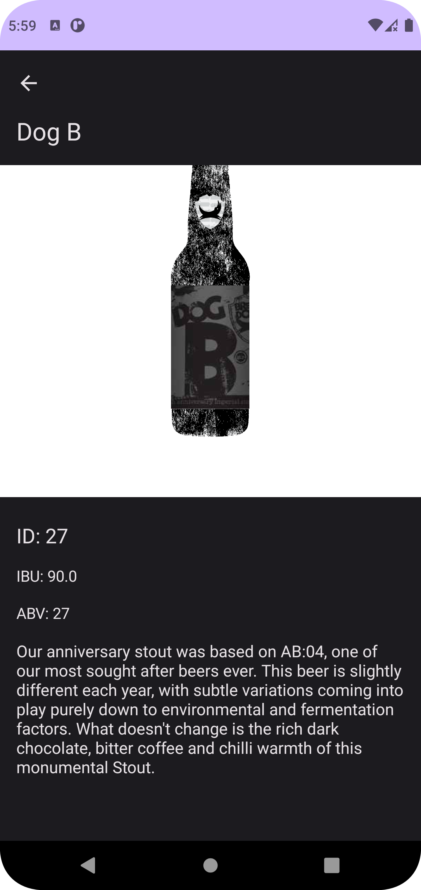

# Beers Pocket 🍻
### Android app challenge.

This app allows you to known and discover every Beer from PunkApi.

## Getting started
Run:
```shell
./gradlew assembleDebug

##Install apk example_app
./gradlew installDebug

#Launch entry activity on example app
adb shell am start -n "com.santiihoyos.beerspocket/com.santiihoyos.beerspocket.ui.feature.home.HomeActivity" \
                   -a android.intent.action.MAIN \
                   -c android.intent.category.LAUNCHER
```

## Features
- Android Api > 21
- Google apps architecture (latest)
- 100% composable
- Versions catalog
- KTS for Gradle
- Material desing 3 initial support
- Koin as Dependency injector
- Coil as image manager
- Paging (android)
- etc...

## Architecture notes

There are 3 gradle modules 2 android (:app, :beers) and 1 kotlin standalone (:api) 

In app module is main app logic like entry points and HomeScreen it depends on `:beers` feature module (witch contains
all related code with beers feature) and `:api` (witch contains all related code to communicate with server by using Rest endpoints).

## layers

By using [Google's architecture definition](https://developer.android.com/topic/architecture) there are:

### UI
Only on :app and :beers module there are "Composables" each one has it ViewModel. (see ui packages).
They implement UDF(Unidirectional data flow) patter states as source of truth from view models and Event system
to notify user inputs from UI to ViewModels.

### Domain
Contains app internal business logic entities and UseCases to reuse login on different ViewModels.
Functions on UseCases are main thread safe. They speak with repositories and provides specific
business app logic error management.

### Data
All data business logic is in :api module, that module contains DataSources interfaces and implementations
to connect with server Rest endpoints, those data sources are used by Repository witch exposes to domain layer
all data functionality and manages data layer errors.

## Testing
beer list flow is tested from ViewModel to DataSource you can see unit test packages in every module.
Tests run by using mockito and coroutines test library.

# Screenshots
 -> 
